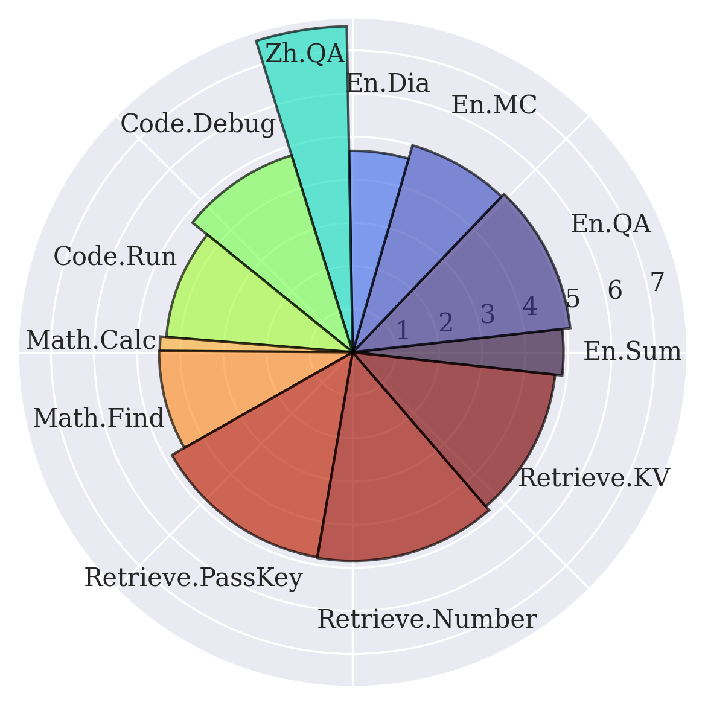

<div align="center">

# InfiniteBench: 100k+ Long-Context Benchmark for Large Language Models

<p align="center">
  <a href="./README_ZH.md">中文</a> •
  <a href="./README.md">English</a> •
  <a href="">(Paper Upcoming)</a>
</p>

</div>

## Introduction

Welcome to InfiniteBench, a cutting-edge benchmark tailored for evaluating the capabilities of language models to process, understand, and reason over super long contexts (100k+ tokens). Long contexts are crucial for enhancing applications with LLMs and achieving high-level interaction. InfiniteBench is designed to push the boundaries of language models by testing them against a context length of 100k+, which is 10 times longer than traditional datasets.

## Features

- **Loooong Context:** InfiniteBench is a pioneer in testing language models with a context length of 100k+, offering an unparalleled challenge in the field.
- **Diverse Domain:** The benchmark comprises 12 unique tasks, each crafted to assess different aspects of language processing and comprehension in extended contexts.
- **Specialized Test:** InfiniteBench consists of tasks that state-of-the-art LLMs are known to be capable of when using shorter context. This ensures that the performance degradation is only caused by the length of the contexts.
- **Real-World and Synthetic Scenarios:** The tasks are a mix of real-world scenarios and synthetic constructs, ensuring a comprehensive evaluation of models. Real-world scenarios make the test pragmatic, and synthetic ones leave the space for extending the context length further with ease.

## Task Composition

<div align="center">
  
</div>

| Task Name            | Context       | # Examples | Avg Input Tokens | Avg Output Tokens | Description                                                                                 |
| -------------------- | ------------- | ---------- | ---------------- | ----------------- | ------------------------------------------------------------------------------------------- |
| En.Sum               | Fake Book     | 103        | 171.5k           | 1.1k              | Summarization of a fake book created with core entity substitution.                         |
| En.QA                | Fake Book     | 351        | 192.6k           | 4.8               | Free-form question answering based on the fake book.                                        |
| En.MC                | Fake Book     | 229        | 184.4k           | 5.3               | Multiple choice questions derived from the fake book.                                       |
| En.Dia               | Script        | 200        | 103.6k           | 3.4               | Identification of talkers in partially anonymized scripts.                                  |
| Zh.QA                | New Book      | 175        | 2068.6k          | 6.3               | Question answering on a set of newly collected books.                                       |
| Code.Debug           | Code Document | 394        | 114.7k           | 4.8               | Finding which function in a code repo contains an crashing error (in multiple choice form). |
| Code.Run             | Synthetic     | 400        | 75.2k            | 1.3               | Simulating execution of multiple simple, synthetic functions.                               |
| Math.Calc            | Synthetic     | 50         | 43.9k            | 43.9k             | Calculations involving super-long arithmetic equations.                                     |
| Math.Find            | Synthetic     | 350        | 87.9k            | 1.3               | Finding special integers in a lengthy list.                                                 |
| Retrieve.PassKey[^1] | Synthetic     | 590        | 122.4k           | 2.0               | Retrieving hidden keys in a noisy long context.                                             |
| Retrieve.Number      | Synthetic     | 590        | 122.4k           | 4.0               | Locating repeated hidden numbers in a noisy long context.                                   |
| Retrieve.KV[^2]      | Synthetic     | 500        | 89.9k            | 22.7              | Finding the corresponding value from a dictionary and a key.                                |

## How to Download Data

Click here to download data from 🤗 Huggingface directly: <https://huggingface.co/datasets/xinrongzhang2022/InfiniteBench>

### Using 🤗 Datasets

Alternatively, you can download using the 🤗 Datasets library as follows.

```python
from datasets import load_dataset
dataset = load_dataset("xinrongzhang2022/InfiniteBench")
```
### Using Scripts

```shell
cd InfiniteBench
bash scripts/download_dataset.sh
```

This will directly dump the data to `data`.

## Evaluation Result

We evaluate SOTA proprietary and open-source LLMs, the result is as follows.

| Task Name        | GPT-4  | YaRN-Mistral-7B | Kimi-Chat | Claude 2 | 
| ---------------- | ------ | --------------- | --------- | -------- |
| Retrieve.PassKey | 100%   | 92.71%          | 98.14%    | 97.80%   | 
| Retrieve.Number  | 100%   | 56.61%          | 95.42%    | 98.14%   |
| Retrieve.KV      | 89.00% | < 5%            | 34.20%    | 65.40%   |
| En.Sum           | 14.73%  | 9.09%            | 17.93%    | 14.45%   | 
| En.QA            | 22.22% | 9.55%          | 16.52%    | 11.97%  |
| En.MC            | 67.25% | 27.95%          | 72.49%    | 62.88%   | 
| En.Dia           | 8.50%  | 7.50%           | 11.50%    | 46.50%   | 
| Zh.QA            | 23.06% | 14.43%          | 18.62%    | 10.53%   | 
| Code.Debug       | 39.59% | < 5%            | 18.02%    | < 5%     | 
| Code.Run         | 23.25% | < 5%            | < 5%      | < 5%     | 
| Math.Calc        | < 5%   | < 5%            | < 5%      | < 5%     | 
| Math.Find        | 60.00% | 17.14%          | 12.57%    | 32.29%   | 

Note:

1. The evaluation code for YaRN-Mistral-7B is implemented by ourselves, and please contact us or submit an issue if there are any problems.
2. Kimi-Chat, Claude 2, and GPT-4 are evaluated using the official API with default configuration.
3. For Math.Calc, the values in the parentheses have a measurement unit of 0.01%. This is because it is easy to get a very low score on this task.
4. The metric for task Math.Find, Math.Calc, Code.Run, Code.Debug, En.Dia, En.MC, Retrieve.KV, Retrieve.Number, and Retrieve.PassKey is accuracy; 

   The metric for task Zh.QA and En.QA are ROUGE F1 score; 
   
   The metric for En.Sum is the `rougeLsum` score from the 🤗 Evaluate library.


<div align="center">
  
</div>

## Installation

```shell
pip install -r requirements.txt
```

## How to Run

Download the dataset the `data` folder (or set the `--data_dir` argument to the location of the dataset). The data folder structure should be as follows.

```
InfiniteBench
├── data
│   ├── code_debug.jsonl
│   ├── code_run.jsonl
│   ├── kv_retrieval.jsonl
│   ├── longbook_choice_eng.jsonl
│   ├── longbook_qa_chn.jsonl
│   ├── longbook_qa_eng.jsonl
│   ├── longbook_sum_eng.jsonl
│   ├── longdialogue_qa_eng.jsonl
│   ├── math_calc.jsonl
│   ├── math_find.jsonl
│   ├── number_string.jsonl
│   ├── passkey.jsonl
│   └── construct_synthetic_dataset.py
...
```

Then, in the `src` folder, execute:

```shell
python eval_yarn_mistral.py --task kv_retrieval
python eval_gpt4.py --task longbook_sum_qa
python eval_rwkv.py --task passkey
```

The available tasks are:

| Task Name        | Argument to specify in `--task` |
| ---------------- | ------------------------------- |
| En.Sum           | longbook_sum_qa                 |
| En.QA            | longbook_qa_eng                 |
| En.MC            | longbook_choice_eng             |
| En.Dia           | longdialogue_qa_eng             |
| Zh.QA            | longbook_qa_chn                 |
| Code.Debug       | code_debug                      |
| Code.Run         | code_run                        |
| Math.Calc        | math_calc                       |
| Math.Find        | math_find                       |
| Retrieve.PassKey | passkey                         |
| Retrieve.Number  | number_string                   |
| Retrieve.KV      | kv_retrieval                    |

## Citation

> This will be updated when our preprint paper is released.

```bibtex
@misc{zhang2023infinitebench,
  title  = {InfiniteBench: 128k Long-Context Benchmark for Language Models},
  author = {Zhang, Xinrong and Chen, Yingfa and Hu, Shengding and Wu, Qihao and Chen, Junhao and Xu, Zihang and Dai, Zhenning and Han, Xu and Wang, Shuo and Liu, Zhiyuan and Sun, Maosong},
  year   = {2023}
}
```

## Acknowledgement

Thanks to Cong Feng, Zhongwu Zhai, Guoyang Zeng, Chenyang Song, Renjie Luo, Chaoqun He, Yuge Tu, Bowen Ping, Yujie Huang, Yudong Mei, Kaihuo Zhang, Weilin Zhao, Ao Sun, Yulin Chen, Ganqu Cui.

## References

[^1]: Mohtashami, Amirkeivan and Martin Jaggi. "Landmark Attention: Random-Access Infinite Context Length for Transformers." ArXiv abs/2305.16300 (2023): n. pag.

[^2]: Liu, Nelson F. et al. "Lost in the Middle: How Language Models Use Long Contexts." ArXiv abs/2307.03172 (2023): n. pag.
